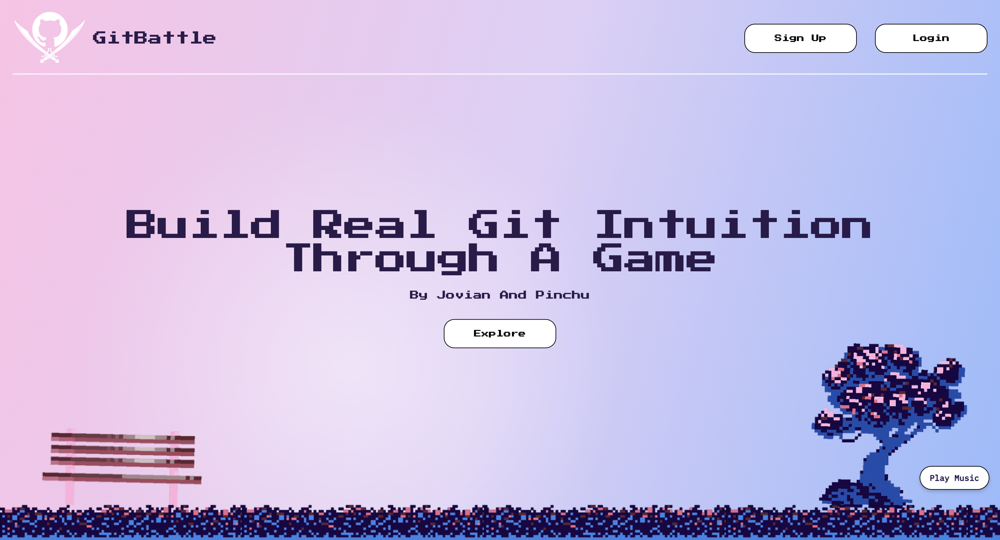
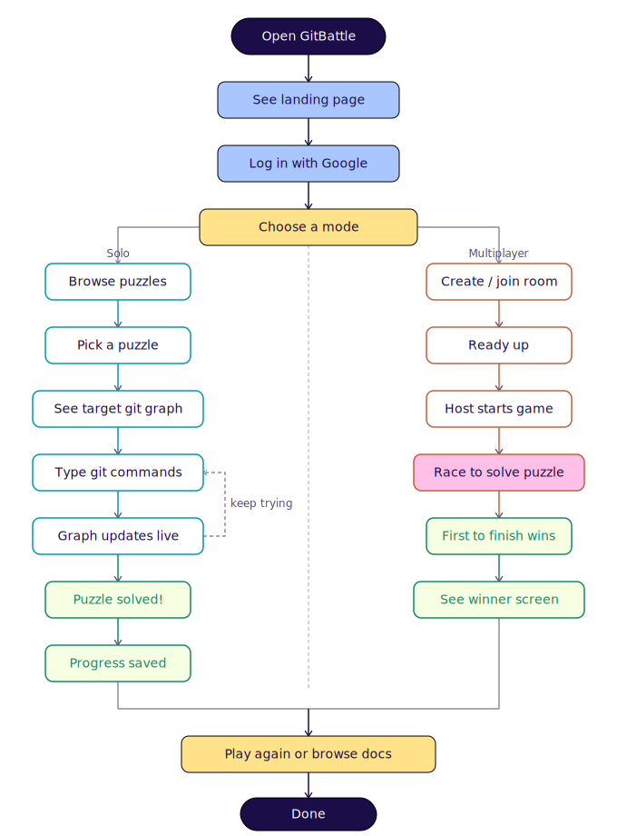
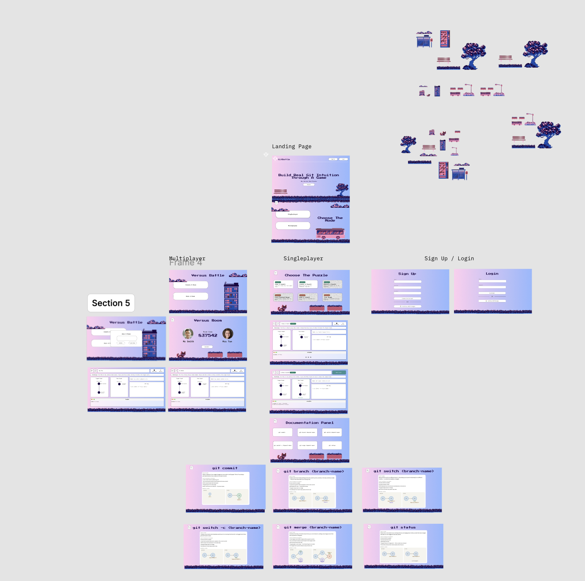

# Team Name: GitBattle





# Motivation
Git is one of the most important tools in software development, yet it is also one of the most
intimidating tools for beginners. Many students learn Git by memorizing commands such as git
branch, git switch, and git merge without truly understanding what these commands do. As a
result, most beginners often become confused when working with branches, merge commits, or
different repository states.
Although there are already Git tutorials, many of them are not very and do not allow the users
to gain hands-on-experience. We believe that there is a room for a learning platform that is
interactive, visual, and fun where users can understand Git by solving puzzles.
Our team is motivated to build GitBattle because we want to make Git learning more intuitive.
We want to create a platform where users are shown a target commit graph and must recreate
it using Git commands. This project is meaningful to us because Git is a practical tool used in
almost every software project and helping beginners to understand it would make this project
valuable.


# Vision
We hope to build an interactive platform that helps users learn Git by challenging them to
recreate target commit graphs using Git commands. The process of recreating the target commit
will help the users learn and build stronger understanding of Git through hands-on practice. In
that way, they can not only understand when to use each Git command but also can understand
the meaning of Git commit graph.


# User Stories
- As a user who is learning Git, I want to visualise how Git commands change repository history, so that I can better understand branching and merging.

- As a user who is learning Git, I want to solve guided puzzles with target commit graphs, so that I can practise Git concepts in a structured and interactive way.

- As a user who is learning Git, I want to have a beginner-friendly git documentation where I can refer when I am trying to solve the puzzle.

- As a user who is learning Git, I want to try competing with others to challenge myself to recreate the target commit graph as fast as possible.


# Features

## Our progress

| Feature | Stage | Description |
|---|---|---|
| Documentation Panel | 🟡 Partial | manual that explains what basic git commands do |
| Git Engine | 🔴 Not Started | terminal to execute the git commands. needs to do more research later |
| Git Graph Represenstation | 🔴 Not Started | the target the current graph |
| Singleplayer Modes | 🟡 Partial | singleplayer game mode to progress different levels |
| Multiplayer Modes - Host Creating Room | 🟡 Partial | generates a room code and creates a 2-player room |
| Multiplayer Modes - Joining Room | 🟡 Partial | the other player can use the code to join the room created |
| Authentication System | 🟡 Partial | login using either Google account or an email account to save the progress |
| Progress Saving | 🔴 Not Started | keeps track of the levels that the player has finished and yet to be finished |

## Additional Feature That Will Be Added Outside Of The Proposal

| Feature | Stage | Description |
|---|---|---|
| Background Music | 🟢 Done | the player can turn on/off the background music to help them relax |
| Restart Git State During The Game | 🔴 Not Started | return the the initial state where the level has just started |
| Information How To Play The Game | 🔴 Not Started | tutorials that instructs the player what to do |
| randomized multiplayer levels | 🔴 Not Started | the levels will be different for each multiplayer match so the player cannot just memorized the exact commands. the need to actually understand them |

## Stage Legend

| Color | Meaning |
|---|---|
| 🟢 Done | Feature is completed |
| 🟡 Partial | Feature is partly implemented |
| 🔴 Not Started | Feature has not been implemented yet |


# How to Run GitBattle

## Prerequisites

Install these first:

- Node.js
- npm
- Docker Desktop

## Project Structure

```text
GitBattle-Orbital26/
├── frontend/
├── backend/
├── docker-compose.yml
└── docker-compose.dev.yml
```

## Run Without Docker

### 1. Install Backend Dependencies

```bash
cd backend
npm install
```

### 2. Install Frontend Dependencies

```bash
cd ../frontend
npm install
```

### 3. Create `.env`

Create a `.env` file in the project root:

```env
PORT=3001
VITE_API_URL=http://localhost:3001
VITE_GOOGLE_CLIENT_ID=your_google_client_id
```

### 4. Start Backend

Open one terminal:

```bash
cd backend
npm run dev
```

Backend runs at:

```text
http://localhost:3001
```

### 5. Start Frontend

Open another terminal:

```bash
cd frontend
npm run dev
```

Frontend runs at:

```text
http://localhost:5173
```

## Run With Docker

### 1. Create `.env`

Create a `.env` file in the project root:

```env
PORT=3001
VITE_API_URL=http://localhost:3001
VITE_GOOGLE_CLIENT_ID=your_google_client_id
```

### 2. Start Docker

## Prerequisites
Make sure docker desktop is open.

Frontend:

```text
http://localhost:5173
```

Backend:

```text
http://localhost:3001
```

## Run With Docker Hot Reload

Use this during development:

```bash
docker compose -f docker-compose.dev.yml up
```

Rebuild if needed:

```bash
docker compose -f docker-compose.dev.yml up --build
```

Backend changes should restart automatically with Nodemon.
Frontend changes should hot reload after saving.

## How To Get Google Client ID

To use Google login, you need to create a Google OAuth Client ID.

### 1. Open Google Cloud Console

Go to:

[https://console.cloud.google.com/](https://console.cloud.google.com/)

### 2. Create Or Select A Project

- Click the project dropdown at the top.
- Select an existing project or click **New Project**.
- Give the project a name, for example:

```txt
GitBattle
```

### 3. Go To OAuth Consent Screen

In the left sidebar, go to:

```txt
APIs & Services > OAuth consent screen
```

Choose:

```txt
External
```

Then fill in the required app information:

```txt
App name: GitBattle
User support email: your email
Developer contact email: your email
```

Save and continue.

### 4. Create OAuth Client ID

Go to:

```txt
APIs & Services > Credentials
```

Click:

```txt
Create Credentials > OAuth client ID
```

Choose application type:

```txt
Web application
```

### 5. Add Authorized JavaScript Origins

For local development, add:

```txt
http://localhost:5173
```

Do not add a trailing slash.

### 6. Copy The Client ID

After creating the credential, Google will show a **Client ID**.

It looks something like:

```txt
1234567890-abcxyz.apps.googleusercontent.com
```

Copy it and put it in your `.env` file:


# Timeline and Development Plan


| Week / Date | Task | Summary |
|---|---|---|
| 18 May 2026 | Project Planning | Discussed task division, progress updates, and sprint workflow. |
| 19 May - 25 May 2026 | UI Design and Learning | Designed the UI in Figma, revised React, TypeScript, and CSS, built early landing and mode selection pages, and learned JavaScript, HTML, CSS, and React basics. |
| 26 May - 31 May 2026 | App Foundation | Built core pages, started authentication and backend setup, created documentation panel screens, configured Docker, and resolved merge conflicts for Milestone 1. |
| 1 June 2026 | Milestone 1 Submission | Outcome : partial frontend, authentication, backend, and documentation panel completed. |
| 2 June - 8 June 2026 | Frontend and GitBattle Engine | Finished the frontend and built the custom Git engine for commands such as commit, branch, switch, merge, and reset. |
| 9 June - 15 June 2026 | GitBattle Graph | Built the graph system that updates based on the Git commands typed by users, including the target graph that users try to imitate. |
| 16 June - 22 June 2026 | Save, Restore, and Reset | Built backend functionality to save, reset, and restore the user’s progress. |
| 23 June - 28 June 2026 | Prototype Testing | Tested puzzle validation, save and restore flow, UI behaviour, and completed unfinished tasks from the previous weeks. |
| 29 June 2026 | Milestone 2 | Expected outcome: GitBattle has a functional single-player prototype with all main UI screens created. |
| 30 June - 6 July 2026 | Multiplayer Room Backend | Built the Socket.IO backend for creating, joining, and managing multiplayer rooms. |
| 7 July - 13 July 2026 | Multiplayer Battle Gameplay | Connected multiplayer rooms to gameplay so users can compete with the same randomized questions. |
| 14 July - 20 July 2026 | Winner Page | Added winner detection and a winner page, then tested the app to ensure the multiplayer flow runs smoothly. |
| 21 July - 26 July 2026 | Final Polish | Finalized deployment, documentation, and code polish. |
| 27 July 2026 | Milestone 3 | Expected Outcome: Complete deployed version of GitBattle. |


# Software Engineering Principles

- **Version control**: Use Git and Github to track changes.

- **Agile Methodologies**: Using sprints for iterative reviews with user stories guiding what gets built each sprint.

- **Security Measures**: Sensitive information like api key is stored in `.env`.


# Intended User Flow in the App




# Figma Design




# Project Log

The project work log can be accessed through the Google Sheets link below:

[GitBattle Work Log](https://docs.google.com/spreadsheets/d/1s6A5wgAP8DIWsnDAzW2wp3sTJR7j-jQw_1eZiEDsW8g/edit?usp=sharing)


