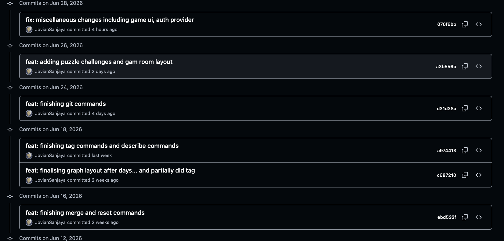
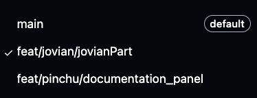
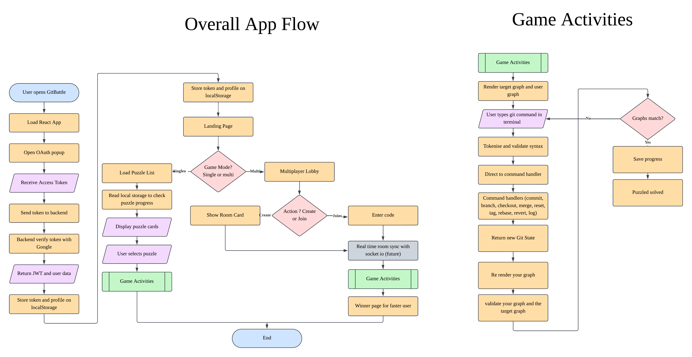
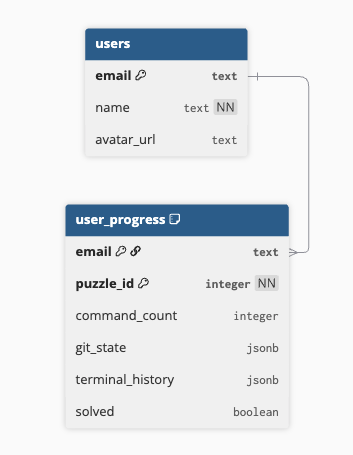

# Team Name: GitBattle | Level of Achievement : Apollo 


# Motivation
Git is one of the most important tools in software development, yet it is also one of the most
intimidating tools for beginners. Many students learn Git by memorizing commands such as git
branch, git checkout, and git merge without truly understanding what these commands do. As a
result, most beginners often become confused when working with branches, merge commits, or
different repository states.
Although there are already Git tutorials, many of them are not very and do not allow the users
to gain hands-on-experience. We believe that there is a room for a learning platform that is
interactive, visual, and fun where users can understand Git by solving puzzles.
Our team is motivated to build GitBattle because we want to make Git learning more intuitive.
We want to create a platform where users are shown a target commit graph and must recreate
it using Git commands. This project is meaningful to us because Git is a practical tool used in
almost every software project and helping beginners to understand it would make this project
valuable.


# Vision
We hope to build an interactive platform that helps users learn Git by challenging them to
recreate target commit graphs using Git commands. The process of recreating the target commit
will help the users learn and build stronger understanding of Git through hands-on practice. In
that way, they can not only understand when to use each Git command but also can understand
the meaning of Git commit graph.


# User Stories
- As a learner, I want to learn git commands into a terminal so that I can practice without affecting a real repository

- As a learner, I want to see my commit graph update in real time so that I can track my progress

- As a learner, I want to see a target commit graph so that I know what I need to recreate

- As a beginner, I want to refer to a git commands reference panel so that I can look up commands while solving puzzles

- As a learner, I want to progress through different levels so that I can learn git concepts incrementally

- As a user, I want to reset the gameplay so that I can start fresh if I get stuck

- As a user, I want to save my progress so that I can continue a level later

- As a user, I want to register and log in so that I can access my account and saved progress

- As a user, I want to create and join a multiplayer room so that I can compete with a friend

- As a user, I want to race against another player on a randomized puzzle so that I have to actually understand git instead of memorizing commands

- As a user, I want to see who won after the match so that I know the result

- As a user, I want a tutorial on how to play so that I can understand the game before starting

- As a user, I want the app to be accessible online so that I can use it anywhere

- As a user, I want to toggle background music so that I can control my playing environment

# Features

## Our progress

| Feature | Stage | Description |
|---|---|---|
| Documentation Panel | 🟢 Done | manual that explains what basic git commands do |
| Git Engine | 🟢 Done | terminal to execute the git commands. needs to do more research later |
| Git Graph Represenstation | 🟢 Done | the target the current graph |
| Singleplayer Modes | 🟢 Done | singleplayer game mode to progress different levels |
| Multiplayer Modes - Host Creating Room | 🟡 Partial | generates a room code and creates a 2-player room |
| Multiplayer Modes - Joining Room | 🟡 Partial | the other player can use the code to join the room created |
| Authentication System | 🟡 Partial | login using either Google account or an email account to save the progress |
| Progress Saving | 🟡 Partial | keeps track of the levels that the player has finished and yet to be finished |

## Additional Feature That Will Be Added Outside Of The Proposal

| Feature | Stage | Description |
|---|---|---|
| Background Music | 🟢 Done | the player can turn on/off the background music to help them relax |
| Restart Git State During The Game | 🟢 Done | return the the initial state where the level has just started |
| Information How To Play The Game | 🟡 Partial | tutorials that instructs the player what to do |
| randomized multiplayer levels | 🔴 Not Started | the levels will be different for each multiplayer match so the player cannot just memorized the exact commands. the need to actually understand them |

## Stage Legend

| Color | Meaning |
|---|---|
| 🟢 Done | Feature is completed |
| 🟡 Partial | Feature is partly implemented |
| 🔴 Not Started | Feature has not been implemented yet |


## Tech Stack

### Frontend

- React: builds the interactive screens and updates the UI when the game state changes.
- TypeScript: helps catch mistakes early by giving types to commits, branches, terminal lines, puzzles, and auth data.
- Tailwind CSS and Pure CSS: styles the pixel-game UI, layout, buttons, cards, terminal, and graph screens.
- Vite: runs the frontend quickly during development and builds the production frontend.

### Backend

- Node.js: runs the backend JavaScript environment.
- Express: provides a simple backend API structure. We use Express over Next.js because it is simpler for our current backend and more direct for future Socket.IO multiplayer work.

### Database

- Supabase: planned database for saving user accounts, puzzle progress, and multiplayer-related data.

### Authentication

- Google OAuth: allows users to sign in using their Google account.

### Deployment

- Vercel: planned frontend deployment platform.
- Render: planned backend deployment platform.

### Real-Time Communication

- Socket.IO: planned real-time communication layer for multiplayer rooms.

### API Communication

- Axios: sends HTTP requests from the frontend to the backend.

### Testing

- Vitest: runs automated tests for Git command behavior and puzzle-related logic.

### Version Control

- GitHub: stores our code, branches, issues, pull requests, and project history.

### Containerisation

- Docker: gives a more consistent way to run the app across machines.
- Docker Compose: starts frontend and backend services together during development.


## Tested Environment

The project was mainly developed and tested using:

| Tool | Version / Notes |
|---|---|
| Operating System | macOS, Linux-style terminal |
| Node.js | Node 20+ |
| npm | npm 10+ |
| Docker Desktop | Used for Docker Compose setup |
| Browser | Chrome |

Windows users can still run the project. WSL is **not required**, but it can help if Windows path, branch-name, shell, or Docker issues appear.


## Supported GitBattle Commands

GitBattle does not support every Git command. It only supports commands needed for the learning puzzles.

| Command | Purpose In The Game |
|---|---|
| `git help` | Shows available commands. |
| `git status` | Shows current branch and basic repository state. |
| `git commit -m "message"` | Creates a new commit on the current branch. |
| `git branch` | Lists branches. |
| `git branch <name>` | Creates a new branch. |
| `git branch -d <name>` | Deletes a branch if allowed. |
| `git checkout <branch>` | Moves HEAD to an existing branch. |
| `git checkout -b <branch>` | Creates a new branch and checks it out. |
| `git merge <branch>` | Merges another branch into the current branch. |
| `git reset --hard <ref>` | Moves the current branch pointer to another commit. |
| `git tag <name>` | Creates a tag label. |
| `git rebase <branch>` | Replays commits on top of another branch. |
| `git revert <ref>` | Creates a new commit that undoes an earlier commit. |
| `git log` | Displays commit history. |
| `git describe` | Describes a commit using tags or references. |


# How to Run GitBattle

## Prerequisites

Install these first:

- Node.js
- npm
- Docker Desktop


## Run Without Docker

### 1. Clone The Repository

```bash
git clone https://github.com/JovianSanjaya/GitBattle-Orbital26.git
cd GitBattle-Orbital26
```

### 2. Checkout To The Correct Branch

```bash
git checkout feat/jovian/jovianPart
```

### 3. Install Backend Dependencies

```bash
cd backend
npm install
```

### 4. Install Frontend Dependencies

```bash
cd ../frontend
npm install
```

### 5. Create Environment File

Create a `.env` file in the project root:

```env
# backend
PORT=3001
GOOGLE_CLIENT_ID=your_google_client_id_here
GOOGLE_CLIENT_SECRET=your_google_client_secret_here
JWT_SECRET=your_jwt_secret_here

# frontend
VITE_API_URL=http://localhost:3001
VITE_GOOGLE_CLIENT_ID=your_google_client_id_here
```

### 6. Start Backend

Open one terminal:

```bash
cd backend
npm run dev
```

Backend runs at `http://localhost:3001`

### 7. Start Frontend

Open another terminal:

```bash
cd frontend
npm run dev
```

Frontend runs at `http://localhost:5173`


## Run With Docker

### 1. Create `.env`
Create a `.env` file in the project root:

```env
# backend
PORT=3001
GOOGLE_CLIENT_ID=your_google_client_id_here
GOOGLE_CLIENT_SECRET=your_google_client_secret_here
JWT_SECRET=your_jwt_secret_here

# frontend
VITE_API_URL=http://localhost:3001
VITE_GOOGLE_CLIENT_ID=your_google_client_id_here
```

### 2. Start Docker
Make sure Docker Desktop is open, then run:

```bash
docker compose up --build
```

Frontend runs at `http://localhost:5173`

Backend runs at `http://localhost:3001`


## How To Get Google Client ID

To use Google login, you need to create a Google OAuth Client ID.

### 1. Open Google Cloud Console

Go to:

[https://console.cloud.google.com/](https://console.cloud.google.com/)

### 2. Create Or Select A Project

- Click the project dropdown at the top.
- Select an existing project or click **New Project**.
- Give the project a name, for example:

```txt
GitBattle
```

### 3. Go To OAuth Consent Screen

In the left sidebar, go to:

```txt
APIs & Services > OAuth consent screen
```

Choose:

```txt
External
```

Then fill in the required app information:

```txt
App name: GitBattle
User support email: your email
Developer contact email: your email
```

Save and continue.

### 4. Create OAuth Client ID

Go to:

```txt
APIs & Services > Credentials
```

Click:

```txt
Create Credentials > OAuth client ID
```

Choose application type:

```txt
Web application
```

### 5. Add Authorized JavaScript Origins

For local development, add:

```txt
http://localhost:5173
```

Do not add a trailing slash.

### 6. Copy The Client ID

After creating the credential, Google will show a **Client ID**.

It looks something like:

```txt
1234567890-abcxyz.apps.googleusercontent.com
```

Copy it and put it in your `.env` file:


# Timeline and Development Plan


| Week / Date | Task | Summary |
|---|---|---|
| 18 May 2026 | Project Planning | Discussed task division, progress updates, and sprint workflow. |
| 19 May - 25 May 2026 | UI Design and Learning | Designed the UI in Figma, revised React, TypeScript, and CSS, built early landing and mode selection pages, and learned JavaScript, HTML, CSS, and React basics. |
| 26 May - 31 May 2026 | App Foundation | Built core pages, started authentication and backend setup, created documentation panel screens, configured Docker, and resolved merge conflicts for Milestone 1. |
| 1 June 2026 | Milestone 1 Submission | Outcome : partial frontend, authentication, backend, and documentation panel completed. |
| 2 June - 8 June 2026 | Frontend and GitBattle Engine | Finished the frontend and built the custom Git engine for commands such as commit, branch, merge, and reset. |
| 9 June - 15 June 2026 | GitBattle Graph | Built the graph system that updates based on the Git commands typed by users, including the target graph that users try to imitate. |
| 16 June - 22 June 2026 | Save, Restore, and Reset | Built backend functionality to save, reset, and restore the user’s progress. |
| 23 June - 28 June 2026 | Prototype Testing | Tested puzzle validation, save and restore flow, UI behaviour, and completed unfinished tasks from the previous weeks. |
| 29 June 2026 | Milestone 2 | Expected outcome: GitBattle has a functional single-player prototype with all main UI screens created. |
| 30 June - 6 July 2026 | Multiplayer Room Backend | Built the Socket.IO backend for creating, joining, and managing multiplayer rooms. |
| 7 July - 13 July 2026 | Multiplayer Battle Gameplay | Connected multiplayer rooms to gameplay so users can compete with the same randomized questions. |
| 14 July - 20 July 2026 | Winner Page | Added winner detection and a winner page, then tested the app to ensure the multiplayer flow runs smoothly. |
| 21 July - 26 July 2026 | Final Polish | Finalized deployment, documentation, and code polish. |
| 27 July 2026 | Milestone 3 | Expected Outcome: Complete deployed version of GitBattle. |


# Software Engineering Principles

## 1. Version Control

We use Use Git and Github to track changes. Below is commits and branches that we use in this project.






## 2. Agile Methodologies

We use Agile process that use sprints for iterative reviews with user stories guiding what gets built each sprint. For milestone 2 onwards, we decide to use github project as to track our progress and to document our agile process. Github Board can be viewed on the link below 

[Agile Documentation](https://docs.google.com/spreadsheets/d/1Q0SiL2zc1XxV3jpiHYW8wpMQ-cnO7B2dccO2nnd95Qw/edit?usp=sharing)


## 3. Security Measures

We include basic security measures to prevent sensitive data from being exposed and to make authentication safer.

| Security Measure | Description |
|---|---|
| Environment variables | Sensitive information such as API keys, Google OAuth credentials, Supabase keys, and `JWT_SECRET` are stored in `.env` files instead of being hardcoded in the source code. |
| Row Level Security (RLS) | Supabase RLS is planned so that users can only access or modify their own saved progress. |
| Protected API routes | Backend routes that handle user data should check authentication before allowing access. |
| Google OAuth verification | Google OAuth tokens are sent to the backend so the backend can verify the user's identity before creating a session. |


# Testing

We use unit tests to check the core Git engine logic because the gameplay depends on whether each Git command changes the commit graph correctly.

The unit tests focus on command behavior without needing to open the browser. This makes it easier to check that the Git engine still works after changes.

To run the unit tests:

```bash
cd frontend
npm test
```

Current unit tests cover:

| Test Area | What It Checks |
|---|---|
| Invalid command handling | The terminal shows an error when the user types an unsupported command. |
| `git help` | The terminal shows the list of supported GitBattle commands. |
| `git status` | The terminal shows the current branch and basic repository state without changing the graph. |
| `git commit` | A new commit is created and the current branch moves forward. |
| `git branch` | Branches can be listed, created, and deleted correctly. |
| `git checkout` | The user can move HEAD to another branch or create and checkout a new branch. |
| `git merge` | Branch histories can be joined correctly. |
| `git reset` | The current branch pointer can move back to another commit. |
| `git tag` | Tags can be created and attached to commits. |
| `git rebase` | Commits can be replayed onto another branch. |
| `git revert` | A new commit is created to undo a previous commit safely. |
| `git log` | The terminal shows commit history from the current HEAD. |
| `git describe` | The terminal describes the current commit using a reachable tag. |
| Puzzle matching | The game can detect when Your Graph matches the Target Graph. |

These tests help prevent regressions when new Git commands, puzzles, or graph-rendering logic are added.


## Problems Encountered

During Milestone 2, we encountered several problems while building GitBattle.

| Problem | Description | How We Addressed It |
|---|---|---|
| Understanding Git behaviour | There are many Git behaviours that we only understood at a surface level at first. Commands such as `git branch`, `git checkout`, `git merge`, `git reset`, `git rebase`, and `git revert` have different effects on commits, branches, and HEAD. | We experimented with real Git commands, studied how each command changes the commit graph, and then translated that behaviour into our GitBattle engine. |
| UI inconsistency | Some parts of the implemented UI did not fully match our Figma design. Certain screens had different spacing, sizing, and layout compared to what we originally planned. | We adapted the design slightly while keeping the main visual style. We adjusted spacing, card sizes, button placement, and layout so the app still looked consistent and usable. |
| Communication misunderstanding | There were a few misunderstandings between teammates about implementation details, task ownership, and expected behaviour. | We addressed the misunderstandings quickly through team discussions and progress check-ins, then clarified what each person needed to work on. |
| Code merge conflicts | Working on different branches caused merge conflicts and duplicated changes. | We used Git branches, commits, and pull requests to separate work and resolved conflicts gradually before combining the changes. |

# Overall Flow of The App




# Intended DB Schema Diagram




# Figma Design


# Project Log

The project work log can be accessed through the Google Sheets link below:

[GitBattle Work Log](https://docs.google.com/spreadsheets/d/1s6A5wgAP8DIWsnDAzW2wp3sTJR7j-jQw_1eZiEDsW8g/edit?usp=sharing)


